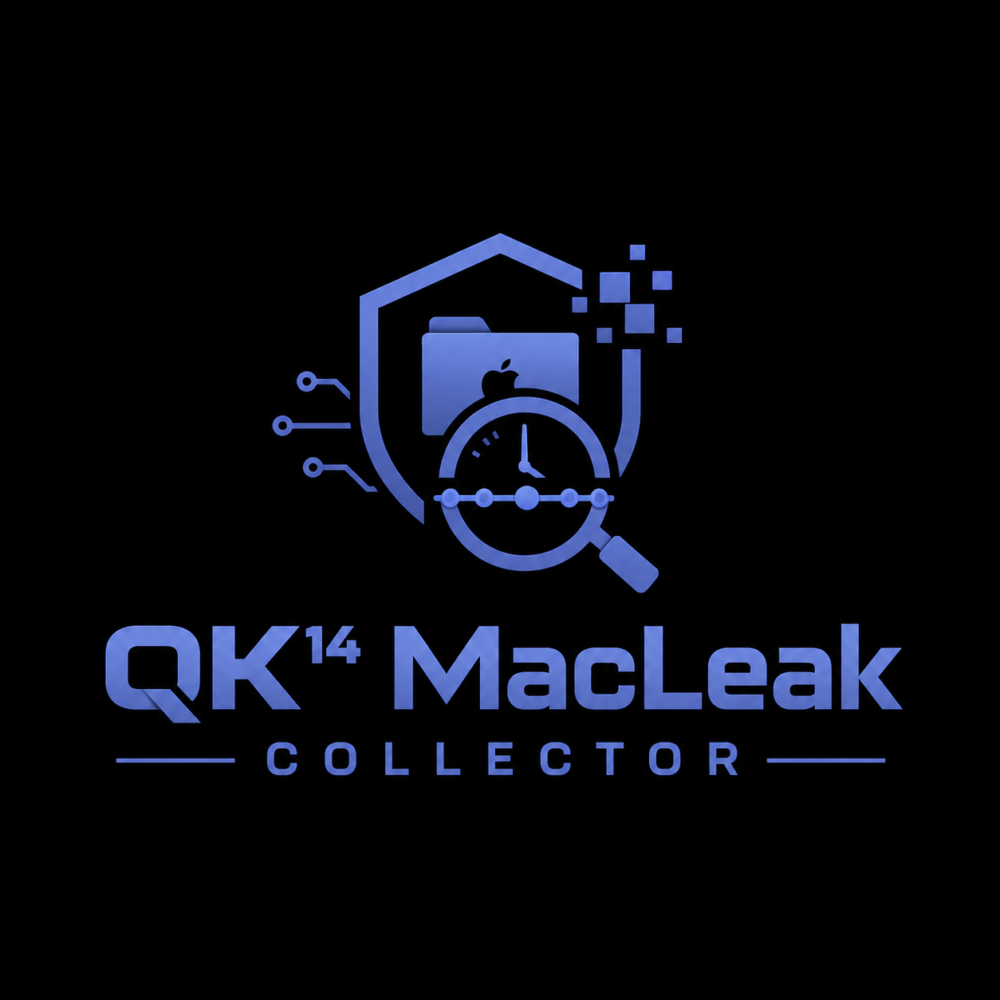

<div align="center">



# QK14 MacLeak Collector

**Adquisición y análisis automático de artefactos forenses en macOS para investigaciones de fuga de información**


</div>

---

## Descripción

**QK14 MacLeak Collector** es un colector forense en Bash diseñado para realizar una adquisición en vivo de artefactos relevantes de macOS y generar automáticamente una cronología de actividad orientada a la investigación de posibles fugas de información.

La herramienta recopila evidencias del sistema, conserva sus rutas y metadatos, calcula hashes SHA-256 y genera un informe HTML autónomo con filtros, indicadores de riesgo y correlaciones temporales.

> La aplicación no sustituye el análisis pericial. Los hallazgos automáticos son indicadores que deben ser revisados, contextualizados y validados por un profesional.

## Funcionalidades principales

- Adquisición ejecutable desde un único archivo `.sh`.
- Selección de la carpeta de destino por el usuario.
- Identificación del procedimiento y del equipo analizado.
- Recogida de artefactos del sistema y de usuarios.
- Preservación de rutas, tamaños y marcas temporales.
- Cálculo SHA-256 de todos los archivos adquiridos.
- Inventario de archivos recientes.
- Análisis automático de bases SQLite y registros.
- Cronología unificada de actividad.
- Detección de posibles acciones de exfiltración.
- Correlación entre compresión, acceso y transferencia.
- Informe HTML interactivo sin dependencias externas.
- Exportación de resultados a TSV y CSV.
- Registro detallado de errores y de la ejecución.

## Artefactos recopilados y analizados

### Sistema

- Versión de macOS.
- Hardware y número de serie.
- APFS, volúmenes y snapshots.
- Estado de FileVault.
- Usuarios y sesiones.
- Procesos y conexiones activas.
- Interfaces, DNS, rutas y sockets.
- Dispositivos USB y volúmenes montados.

### Actividad del usuario

- Archivos recientes.
- Descargas.
- Historiales de navegación.
- Quarantine Events.
- KnowledgeC.
- Recent Items.
- Historiales de Zsh y Bash.
- Instalaciones.
- Papelera y ubicaciones habituales de trabajo.

### Navegadores

- Safari.
- Google Chrome.
- Microsoft Edge.
- Brave.
- Chromium.
- Arc.
- Firefox.

### Nube y transferencia

- iCloud Drive.
- Dropbox.
- Google Drive.
- OneDrive.
- Box.
- Mega.
- Nextcloud.
- Cyberduck.
- FileZilla.
- Transmit.
- SSH, SCP, SFTP, rsync y rclone.
- TeamViewer y AnyDesk.

### Persistencia y seguridad

- LaunchAgents.
- LaunchDaemons.
- Login Items.
- Extensiones.
- TCC.
- Unified Logs.
- OpenBSM, cuando esté disponible.
- Configuración SSH y claves autorizadas.

### Comunicaciones opcionales

Cuando se activa `--include-communications`, también se intentan adquirir y analizar:

- Apple Mail.
- Messages.
- Adjuntos.
- Perfiles de aplicaciones de comunicación.

Esta opción puede incluir información privada y debe utilizarse únicamente cuando esté dentro del objeto y alcance de la investigación.

## Requisitos

- macOS.
- Terminal o iTerm con **Acceso total al disco**.
- Privilegios administrativos.
- Soporte externo con espacio suficiente.
- Mac encendido y desbloqueado cuando FileVault esté activo.
- Autorización legal o consentimiento válido para realizar la adquisición.

No requiere instalar Python, Homebrew ni paquetes adicionales.

## Preparación del Mac

Conceda Acceso total al disco a la aplicación de terminal utilizada:

```text
Ajustes del Sistema
└── Privacidad y seguridad
    └── Acceso total al disco
        └── Terminal o iTerm
```

Se recomienda:

1. Ejecutar la herramienta desde un soporte externo previamente validado.
2. Guardar la adquisición en una unidad diferente del disco examinado.
3. Documentar el estado inicial del equipo.
4. Mantener el equipo conectado a la corriente.
5. No apagar un Mac desbloqueado con FileVault sin valorar previamente las consecuencias.

## Instalación

Clone el repositorio:

```bash
git clone https://github.com/USUARIO/QK14-MacLeak-Collector.git
cd QK14-MacLeak-Collector
```

Conceda permisos de ejecución:

```bash
chmod +x QK14_MacLeak_Collector.sh
```

## Uso interactivo

```bash
sudo ./QK14_MacLeak_Collector.sh
```

La herramienta solicitará:

- Carpeta de destino.
- Identificador del procedimiento.

## Uso recomendado

```bash
sudo ./QK14_MacLeak_Collector.sh \
  --destination /Volumes/EVIDENCIA \
  --case PER-2026-001 \
  --log-days 30 \
  --recent-days 90 \
  --hash-recent-files
```

## Opciones

| Opción | Descripción |
|---|---|
| `-d, --destination RUTA` | Carpeta padre donde se guardará la adquisición |
| `-c, --case ID` | Identificador del procedimiento |
| `-l, --log-days N` | Días de Unified Logs; valor predeterminado: 7 |
| `-r, --recent-days N` | Días para el inventario de archivos recientes; valor predeterminado: 30 |
| `--include-communications` | Incluye bases de mensajería, correo y adjuntos |
| `--hash-recent-files` | Calcula SHA-256 de los archivos recientes inventariados |
| `--deep` | Intenta copiar FSEvents y almacenes Spotlight |
| `--no-analysis` | Realiza la adquisición sin generar el análisis automático |

## Ejemplos

### Adquisición estándar

```bash
sudo ./QK14_MacLeak_Collector.sh \
  --destination /Volumes/EVIDENCIA \
  --case PER-2026-001
```

### Investigación ampliada de fuga

```bash
sudo ./QK14_MacLeak_Collector.sh \
  --destination /Volumes/EVIDENCIA \
  --case PER-2026-001 \
  --log-days 30 \
  --recent-days 90 \
  --hash-recent-files \
  --deep
```

### Incluir comunicaciones

```bash
sudo ./QK14_MacLeak_Collector.sh \
  --destination /Volumes/EVIDENCIA \
  --case PER-2026-001 \
  --include-communications
```

## Estructura de salida

```text
QK14_MacLeak_PER-2026-001_YYYYMMDDTHHMMSSZ/
├── 00_case/
│   ├── acquisition.log
│   ├── case_info.txt
│   ├── errors.log
│   └── README.txt
├── 01_system/
├── 02_live/
├── 03_network/
├── 04_persistence/
├── 05_unified_logs/
├── 06_recent_inventory/
├── 07_artifacts/
│   └── filesystem/
├── 08_reports/
│   ├── QK14_MacLeak_Timeline.html
│   ├── timeline_activity.tsv
│   ├── automatic_findings.tsv
│   ├── undated_evidence.tsv
│   ├── artifact_coverage.tsv
│   ├── analysis.log
│   └── analysis_errors.log
├── 09_manifests/
│   ├── SHA256SUMS.txt
│   ├── manifest_sha256_timestamps.tsv
│   └── manifest_control_sha256.txt
└── 10_collector/
```

## Informe HTML

El archivo principal se genera en:

```text
08_reports/QK14_MacLeak_Timeline.html
```

Incluye:

- Resumen de la adquisición.
- Número total de eventos.
- Hallazgos clasificados por riesgo.
- Cronología ordenada por fecha y hora.
- Búsqueda libre.
- Filtros por usuario, categoría, aplicación y riesgo.
- Filtro por intervalo temporal.
- Evidencias sin fecha fiable.
- Matriz de cobertura.
- Exportación de las filas visibles.

El informe funciona localmente y no necesita conexión a Internet.

## Cronología normalizada

Cada evento puede contener:

| Campo | Descripción |
|---|---|
| Fecha y hora | Momento asociado al evento |
| Usuario | Usuario relacionado |
| Categoría | Navegación, archivo, nube, transferencia, persistencia, etc. |
| Acción | Creación, apertura, descarga, subida, ejecución o eliminación |
| Aplicación | Programa o proceso asociado |
| Objeto | Archivo, URL, dispositivo o recurso |
| Detalles | Información adicional |
| Fuente | Artefacto del que se obtiene el evento |
| Confianza | Alta, media o baja |
| Riesgo | Informativo, bajo, medio, alto o crítico |
| SHA-256 | Hash del artefacto fuente |

## Indicadores automáticos

La herramienta eleva, entre otros, los siguientes patrones:

- Uso de SCP, SFTP, rsync, rclone o netcat.
- Cargas mediante `curl`.
- Transferencias mediante AirDrop.
- Subidas y comparticiones en servicios de nube.
- Creación de ZIP, RAR, 7z, TAR, DMG o ISO.
- Archivos contenedores de gran tamaño.
- Adjuntos enviados.
- Ejecución desde rutas temporales.
- Persistencias sospechosas.
- Eliminación de archivos o historiales.
- Posibles acciones antiforenses.
- Creación de un contenedor seguida de una transferencia por el mismo usuario.

## Integridad y trazabilidad

La adquisición genera un manifiesto general:

```text
09_manifests/manifest_sha256_timestamps.tsv
```

Para cada archivo adquirido registra:

- SHA-256.
- Tamaño.
- Fecha de creación.
- Fecha de modificación.
- Fecha de cambio de metadatos.
- Fecha de último acceso.
- Fecha de la copia adquirida.
- Ruta original.
- Ruta dentro de la adquisición.

SHA-256 de esta versión del colector:

```text
2f7fa311bc607098f14bddd78e37c3b38b147298ea908d558e2d23bb2367581f
```

## Consideraciones forenses

- La ejecución sobre un sistema vivo produce modificaciones inevitables.
- Las fechas de acceso pueden estar deshabilitadas, diferidas o alteradas.
- La ausencia de un evento no demuestra que una acción no haya ocurrido.
- Los formatos internos pueden variar según la versión de macOS.
- Los resultados heurísticos deben comprobarse contra el artefacto original.
- FSEvents no proporciona necesariamente una fecha exacta para cada evento.
- Spotlight, OpenBSM y otros formatos pueden requerir herramientas adicionales.
- El colector no extrae contraseñas, cookies ni claves privadas SSH por defecto.
- Debe conservarse una copia maestra y realizar el análisis sobre una copia de trabajo.

## Validación

Antes de utilizar la herramienta en un procedimiento judicial:

1. Revise el código fuente.
2. Verifique el SHA-256.
3. Ejecútela en un Mac de laboratorio.
4. Compruebe cada parser en las versiones de macOS utilizadas.
5. Documente las pruebas de validación.
6. Registre cualquier limitación o error observado.

## Uso responsable

Esta herramienta está destinada exclusivamente a:

- Investigaciones forenses autorizadas.
- Respuesta ante incidentes.
- Auditorías internas.
- Análisis corporativos.
- Actuaciones periciales.
- Investigación académica y formación.

No debe utilizarse para acceder, recopilar o analizar información sin autorización.

## Autor

**Jorge Coronado**  
Perito informático, especialista en informática forense, ciberseguridad y OSINT.  
CEO de QuantiKa14.

- [LinkedIn](https://www.linkedin.com/in/jorge-coronado-quantika14/)
- [Instagram: @elperitoinf](https://www.instagram.com/elperitoinf/)
- [QuantiKa14](https://quantika14.com/)

## Contribuciones

Las propuestas de mejora, nuevos parsers y correcciones son bienvenidas mediante:

- Issues.
- Pull requests.
- Informes de compatibilidad por versión de macOS.
- Casos de prueba anonimizados.
- Documentación técnica.

Antes de enviar evidencias o ejemplos, elimine cualquier dato personal, secreto o información perteneciente a un procedimiento real.

## Aviso

El autor y QuantiKa14 no se responsabilizan del uso no autorizado de la herramienta ni de conclusiones obtenidas sin una validación pericial adecuada.

